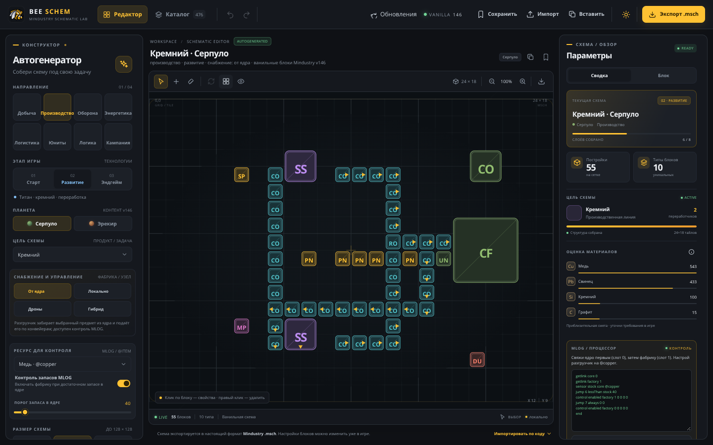

# 🐝 Bee Schematic Lab — запуск для чайников

Эта инструкция — для тех, кто **ни разу не запускал подобные проекты** и не знает, что такое «терминал». Программировать ничего не нужно: достаточно по порядку выполнить шаги и скопировать несколько команд. Всё займёт 10–15 минут.



*Если у вас в браузере открылось такое окно — вы всё сделали правильно.*

**Выберите свою систему:** [Windows](#windows) · [macOS](#macos) · [Linux (Ubuntu, Debian, Mint)](#linux-ubuntu-debian-mint)

**Что-то не получается?** Загляните в раздел [«Если что-то пошло не так»](#если-что-то-пошло-не-так).

---

## Как это работает (30 секунд, чтобы не пугаться)

Bee Schematic Lab — это не «программа с установщиком», а **сайт, который работает прямо на вашем компьютере**. Поэтому запуск состоит из трёх частей:

1. **Node.js** — «движок», на котором работает сайт. Ставится один раз, как обычная программа.
2. **Папка с проектом** — файлы приложения. Их нужно скачать с GitHub.
3. **Две команды в терминале.** Первая, `npm install`, докачивает нужные «детальки» — её выполняют один раз. Вторая, `npm run dev`, включает сайт.

После этого вы открываете в обычном браузере адрес **http://localhost:5173** — и приложение перед вами. `localhost` означает «этот же компьютер»: ваши схемы никуда в интернет не отправляются.

**Три незнакомых слова:**

- **Терминал** (в Windows он называется «Командная строка») — окно, в которое команды вводят текстом. Бояться нечего: вы будете только копировать команды отсюда и вставлять их. Вставить — **Ctrl+V** (в терминале Linux — **Ctrl+Shift+V**, на Mac — **Cmd+V**), затем нажать **Enter**.
- **Node.js и npm** — Node.js запускает сайт, а npm докачивает для него нужные «детальки». Устанавливаются вместе, одним установщиком.
- **Сервер** — маленькая программа, которая «раздаёт» сайт вашему браузеру. Пока она работает, окно терминала **должно оставаться открытым**: закрыли окно — сайт перестал открываться.

## Что понадобится

- Компьютер с **Windows 10/11**, **macOS** или **Linux** (Ubuntu, Debian, Linux Mint).
- **Интернет** — на время установки (скачать Node.js и проект). Потом приложение работает и без него: пропадут только красивые шрифты (они подгружаются из Google Fonts) и проверка обновлений.
- Около **300 МБ** свободного места.
- Любой современный **браузер**: Chrome, Edge, Firefox, Safari.

## Шпаргалка для тех, кто «в теме»

Если вы знаете, что такое терминал, `git` и Node.js, — вот весь процесс целиком. Нужны `git` и Node.js 22.12 или новее (лучше текущая LTS — сейчас это 24). Остальным — подробные шаги ниже.

```bash
git clone https://github.com/danilka-revin/esp32-----html.git
cd esp32-----html
npm install
npm run dev
```

Дальше откройте в браузере **http://localhost:5173**.

---

## Windows

### Шаг 1. Установите Node.js

1. Откройте в браузере страницу **https://nodejs.org/en/download**.
2. Скачайте **Windows Installer (.msi)** — это обычный установщик (около 30 МБ). Нужна версия **LTS**: на странице она выбрана по умолчанию.

   > 💡 Не нашли такую ссылку? Откройте **https://nodejs.org/dist/latest-v24.x/** и скачайте файл, имя которого заканчивается на **`-x64.msi`** (например, `node-v24.21.0-x64.msi`).

3. Запустите скачанный файл. Нажимайте **Next** («Далее»); на странице лицензии поставьте галочку «I accept the terms…» и снова **Next**.

   > ⚠️ На странице **Tools for Native Modules** галочку «Automatically install the necessary tools» **не ставьте** — приложению это не нужно, а скачается много лишнего.

4. Нажмите **Install**, разрешите изменения, если Windows спросит, дождитесь окончания и нажмите **Finish**.
5. **Проверьте установку.** Нажмите **Win+R**, введите `cmd` и нажмите **Enter**. В чёрном окне наберите `node -v` и **Enter**. Должно появиться что-то вроде `v24.21.0` — подойдёт любое число **v22.12 и выше**. Затем введите `npm -v` — должен появиться номер версии. Окно можно закрыть.

> 💡 Node.js уже был установлен раньше? Проверьте версию командой `node -v`. Если она меньше 22.12 (например, `v18.20.4`), поставьте новую версию поверх старой тем же установщиком, а потом прочитайте [этот пункт](#слишком-старый-nodejs-ошибки-styletext-и-ebadengine).

### Шаг 2. Скачайте проект

1. Откройте страницу проекта: **https://github.com/danilka-revin/esp32-----html**
2. Нажмите зелёную кнопку **Code** и выберите **Download ZIP**. Скачается файл `esp32-----html-main.zip` (около 150 КБ).
3. Найдите его в папке «Загрузки», нажмите правой кнопкой мыши → **Извлечь всё…** → в поле пути впишите простое место без пробелов и русских букв, например `C:\bee` → **Извлечь**.

   > ⚠️ Не запускайте ничего прямо из ZIP-архива (когда вы просто «открыли» его двойным щелчком). Сначала обязательно **извлеките** файлы.

4. Откройте извлечённую папку и заходите внутрь, пока не увидите файл **`package.json`** и папки `src` и `public`. Это и есть **папка проекта**. Обычно она называется `esp32-----html-main`; иногда она оказывается вложенной в такую же папку — тогда зайдите ещё раз внутрь.

### Шаг 3. Откройте терминал в папке проекта

Находясь внутри папки проекта (там, где виден `package.json`), щёлкните левой кнопкой мыши по **адресной строке** вверху окна — туда, где написан путь, например `C:\bee\esp32-----html-main`. Сотрите написанное, введите **`cmd`** и нажмите **Enter**.

Откроется чёрное окно терминала, которое уже «стоит» в нужной папке. В его последней строке будет путь к папке проекта, например:

```text
C:\bee\esp32-----html-main>
```

> 💡 Почему не PowerShell? На «чистой» Windows его защита от скриптов часто мешает запустить `npm`. Обычная «Командная строка» (`cmd`) такой проблемы не знает.

### Шаг 4. Установите «детальки» проекта (один раз)

Скопируйте команду, вставьте её в чёрное окно (правая кнопка мыши или **Ctrl+V**) и нажмите **Enter**:

```bash
npm install
```

Подождите — от 10 секунд до пары минут. Закончилось, когда вы видите что-то вроде этого и снова появилась строка с путём:

```text
added 22 packages, and audited 23 packages in 14s

9 packages are looking for funding
  run `npm fund` for details

found 0 vulnerabilities
```

> 💡 Серые или жёлтые строки `npm notice …` про «новую версию npm» — это **не ошибка**, их можно игнорировать.

### Шаг 5. Запустите приложение

```bash
npm run dev
```

Появится примерно такой текст:

```text
> mindustry-schematic-lab@1.0.0 dev
> vite --host 0.0.0.0

  VITE v8.3.2  ready in 190 ms

  ➜  Local:   http://localhost:5173/
  ➜  Network: http://192.168.0.15:5173/
```

Строка для ввода после этого **не вернётся** — так и должно быть: сервер работает. **Не закрывайте это окно.**

> 💡 Если Windows спросит про «Брандмауэр» и Node.js, нажмите **Разрешить доступ** (или **Отмена** — для работы на этом же компьютере разницы нет).

### Шаг 6. Откройте приложение в браузере

Откройте браузер и введите в адресной строке адрес из строки **`Local:`** — обычно это **http://localhost:5173**.

Должно открыться приложение, как на картинке в начале инструкции. Поздравляем! 🎉 Что делать дальше — в разделе [«Первые 5 минут в приложении»](#первые-5-минут-в-приложении).

### Как остановить и запустить в следующий раз

- **Остановить:** в чёрном окне нажмите **Ctrl+C** (если спросит «Завершить выполнение пакетного файла [Y(да)/N(нет)]?» — введите `Y` и **Enter**) или просто закройте окно.
- **Запустить снова:** откройте папку проекта → щёлкните по адресной строке → введите `cmd` → **Enter** → выполните `npm run dev` → откройте адрес в браузере. Команду `npm install` повторять **не нужно**.

---

## macOS

### Шаг 1. Установите Node.js

1. Откройте **https://nodejs.org/en/download** и скачайте **macOS Installer (.pkg)** — версию **LTS**.

   > 💡 Не нашли такую ссылку? Откройте **https://nodejs.org/dist/latest-v24.x/** и скачайте файл, имя которого заканчивается на **`.pkg`** (например, `node-v24.21.0.pkg`). Установщик 24-й версии не запускается на вашем старом Mac? Возьмите версию 22: **https://nodejs.org/dist/latest-v22.x/**.

2. Откройте скачанный файл и везде нажимайте «Продолжить» → «Установить» (введите пароль от вашего Mac) → «Закрыть».
3. Откройте **Терминал**: нажмите **Cmd+Пробел**, начните печатать «Терминал» и нажмите **Enter**.
4. **Проверьте установку:** наберите `node -v` и нажмите **Enter**. Должно появиться что-то вроде `v24.21.0` — подойдёт любое число **v22.12 и выше**.

> 💡 Пользуетесь Homebrew? Тогда достаточно `brew install node`. Node.js уже был установлен раньше, но версия меньше 22.12? Поставьте новую версию поверх старой и прочитайте [этот пункт](#слишком-старый-nodejs-ошибки-styletext-и-ebadengine).

### Шаг 2. Скачайте проект

1. Откройте страницу проекта: **https://github.com/danilka-revin/esp32-----html**
2. Нажмите зелёную кнопку **Code** и выберите **Download ZIP**.
3. Распакуйте скачанный файл `esp32-----html-main.zip` двойным щелчком (Safari делает это сам). Появится папка `esp32-----html-main`. Перенесите её в удобное место, например в «Документы».

### Шаг 3. Откройте Терминал в папке проекта

1. В Терминале напечатайте `cd` и **поставьте после него пробел** — но **Enter пока не нажимайте**.
2. **Перетащите папку проекта из Finder в окно Терминала** — путь подставится сам.
3. Теперь нажмите **Enter**.
4. **Проверьте:** введите `ls` и нажмите **Enter**. В списке должен быть файл `package.json`.

> 💡 Если macOS спросит разрешение на доступ Терминала к папке («Документы», «Рабочий стол» и т. п.) — нажмите **OK**.

### Шаг 4. Установите «детальки» проекта (один раз)

```bash
npm install
```

Подождите — от 10 секунд до пары минут. Закончилось, когда вы видите что-то вроде этого и снова появилась строка для ввода:

```text
added 22 packages, and audited 23 packages in 14s

9 packages are looking for funding
  run `npm fund` for details

found 0 vulnerabilities
```

> 💡 Строки `npm notice …` про «новую версию npm» — это **не ошибка**, их можно игнорировать.

### Шаг 5. Запустите приложение

```bash
npm run dev
```

Появится примерно такой текст:

```text
> mindustry-schematic-lab@1.0.0 dev
> vite --host 0.0.0.0

  VITE v8.3.2  ready in 190 ms

  ➜  Local:   http://localhost:5173/
  ➜  Network: http://192.168.0.15:5173/
```

Строка для ввода после этого **не вернётся** — так и должно быть: сервер работает. **Не закрывайте это окно Терминала.**

> 💡 Если macOS вдруг покажет окно с предложением установить «средства командной строки» (Command Line Tools) — скорее всего, это из-за программы `git`: при запуске приложение спрашивает у неё номер своей версии. Можно нажать **Не сейчас** — приложение работает и без этого.

### Шаг 6. Откройте приложение в браузере

Откройте браузер и введите в адресной строке адрес из строки **`Local:`** — обычно это **http://localhost:5173**. Можно зажать **Cmd** и щёлкнуть по ссылке прямо в Терминале.

Должно открыться приложение, как на картинке в начале инструкции. Поздравляем! 🎉 Что делать дальше — в разделе [«Первые 5 минут в приложении»](#первые-5-минут-в-приложении).

### Как остановить и запустить в следующий раз

- **Остановить:** в окне Терминала нажмите **Ctrl+C** (именно **Control**, а не Cmd) или просто закройте окно.
- **Запустить снова:** откройте Терминал → напечатайте `cd`, поставьте пробел и перетащите папку проекта в окно → **Enter** → выполните `npm run dev` → откройте адрес в браузере. Команду `npm install` повторять **не нужно**.

---

## Linux (Ubuntu, Debian, Mint)

Инструкция написана для Ubuntu, Debian и Linux Mint. Для других дистрибутивов суть та же: нужны `git` и Node.js 22.12 или новее.

### Шаг 1. Откройте терминал

Нажмите **Ctrl+Alt+T** или найдите «Терминал» в меню приложений.

> 💡 Две мелочи, которые сбивают с толку новичков:
> - вставка в терминале — **Ctrl+Shift+V** (а не Ctrl+V);
> - когда вы вводите пароль для `sudo`, на экране **ничего не появляется** (даже звёздочек) — так и должно быть. Просто введите пароль и нажмите **Enter**.

### Шаг 2. Установите git и Node.js 24

> ⚠️ **Не ставьте Node.js командой `sudo apt install nodejs`.** В стандартных репозиториях Ubuntu 22.04 лежит Node.js 12, а в Ubuntu 24.04 и Debian 12 — Node.js 18. Для приложения это слишком старо: оно просто не запустится. Поэтому берём свежую версию из официального репозитория NodeSource.

Вставляйте команды по очереди (после каждой — **Enter**):

```bash
sudo apt-get update
sudo apt-get install -y curl git
curl -fsSL https://deb.nodesource.com/setup_24.x | sudo -E bash -
sudo apt-get install -y nodejs
```

Проверка — должно появиться `v24.…`:

```bash
node -v
```

> 💡 Раньше ставили Node.js через `apt` (в том числе установочным скриптом проекта)? Сначала удалите старую версию командой `sudo apt-get remove -y nodejs npm`, а потом выполните команды выше и прочитайте [этот пункт](#слишком-старый-nodejs-ошибки-styletext-и-ebadengine).
>
> Debian без `sudo`: войдите под root командой `su -` и выполните те же команды без слова `sudo`.

### Шаг 3. Скачайте проект

```bash
git clone https://github.com/danilka-revin/esp32-----html.git
cd esp32-----html
```

Проект скачается в вашу домашнюю папку.

> 💡 Папка называется `esp32-----html` (пять дефисов). Чтобы не ошибиться, напишите `cd esp` и нажмите **Tab** — терминал допишет название сам.

### Шаг 4. Запустите приложение — выберите способ

#### Способ А (рекомендуется): ярлык в меню приложений + автообновление

```bash
bash scripts/install-shortcut.sh
```

Скрипт сам всё проверит, скачает последнюю версию, установит «детальки», соберёт приложение и добавит в меню значок **Bee Schematic Lab**. Он может попросить пароль (`sudo`) — это нормально. В конце он спросит «Запустить … прямо сейчас? [Y/n]» — просто нажмите **Enter**: откроется браузер с приложением по адресу **http://localhost:4173**.

> 💡 У ярлыка адрес другой — **:4173**, а не :5173. Так и задумано: ярлык запускает собранную (ускоренную) версию.

- **Запустить в следующий раз:** нажмите клавишу **Super** (с флажком Windows), начните печатать «Bee» и щёлкните по **Bee Schematic Lab**. Откроется окно терминала (пусть остаётся открытым) и браузер. При каждом запуске ярлык сам подтягивает свежую версию приложения (для этого нужен интернет).
- **Остановить:** в окне терминала нажмите **Ctrl+C** или просто закройте его.
- **Значка нет в меню?** Выйдите из системы и войдите снова.
- **Нажали на значок — и ничего не происходит?** Ярлык запускает программу `gnome-terminal`, а в новых Ubuntu (25.10 и 26.04) терминал по умолчанию другой (Ptyxis), поэтому `gnome-terminal` может быть не установлен. Поставьте его командой `sudo apt-get install -y gnome-terminal` и нажмите на значок ещё раз.

#### Способ Б: без ярлыка (так же, как в Windows и macOS)

```bash
npm install
npm run dev
```

Откройте в браузере адрес из строки **`Local:`** — обычно это **http://localhost:5173**. Остановить — **Ctrl+C** в окне терминала.

В следующий раз: откройте терминал → `cd esp32-----html` → `npm run dev` → откройте адрес в браузере. Команду `npm install` повторять **не нужно**.

> 💡 **Не смешивайте способы А и Б.** У них разные адреса (`:4173` и `:5173`), а схемы, сохранённые кнопкой «Сохранить», привязаны к адресу и браузеру — по другому адресу вы их не увидите.

---

## Первые 5 минут в приложении

1. Слева находится панель **«Автогенератор»**. Выберите **Направление** (Добыча, Производство, Оборона…), **Этап игры**, **Планету** (Серпуло или Эрекир) и **Цель схемы**.
2. Ниже, после настроек, нажмите **«Сгенерировать схему»** — схема появится в центре экрана.
3. Схему можно править руками: перетаскивайте блоки из «Быстрой палитры» на сетку, щёлкайте по блоку, чтобы увидеть его свойства (правый щелчок — удалить). Клавиша **R** поворачивает выбранный блок, **Delete** — удаляет, **Ctrl+Z** — отменяет последнее действие.
4. Кнопка **«Экспорт .msch»** (справа вверху) скачивает файл схемы для игры. Справа в панели есть ещё **«Копировать код схемы»** — то же самое, но в виде текста, который можно вставить из буфера обмена.
5. **В игре Mindustry** откройте меню схем → **Import schematic** → **Import file** (выберите скачанный `.msch`) или **Import from clipboard** (вставится скопированный код).
6. Кнопка **«Сохранить»** вверху запоминает схему в вашем браузере — она появится в разделе «Мои схемы» справа.

Подробный список возможностей — в [README](../README.md#возможности).

---

## Как обновить, остановить и удалить

### Обновить до новой версии

Автор время от времени выкладывает новые версии на GitHub.

- **Windows и macOS (скачивали ZIP):** скачайте ZIP заново (шаг 2), распакуйте в **новую** папку, откройте в ней терминал и выполните `npm install`, а затем `npm run dev`. Старую папку можно удалить. Перед запуском новой версии **остановите старую** (**Ctrl+C**) — иначе порт 5173 будет занят, адрес изменится, и сохранённых схем вы не увидите (см. [FAQ](#пропали-схемы-которые-я-сохранял)).
- **Linux, способ А (ярлык):** ничего делать не нужно — ярлык обновляется сам при каждом запуске.
- **Linux, способ Б:** в терминале выполните `cd esp32-----html`, затем `git pull` и `npm install`, после чего — `npm run dev`.

### Остановить

В окне терминала нажмите **Ctrl+C** или просто закройте это окно. Сайт перестанет открываться — это нормально.

### Удалить

- Удалите папку проекта. Схемы, сохранённые в браузере, при этом останутся в нём.
- **Windows:** если Node.js больше не нужен — «Параметры» → «Приложения» → «Установленные приложения» (в Windows 10 — «Приложения и возможности») → **Node.js** → «Удалить».
- **Linux (способ А):** сначала уберите ярлык командой `bash scripts/install-shortcut.sh remove`, а потом удалите папку проекта.

---

## Полезные мелочи

- **Проверить, что всё установилось правильно.** Выполните в папке проекта `npm test`. Если всё в порядке, в конце будет строка `# fail 0`.
- **Открыть приложение с телефона или планшета.** Если они подключены к той же Wi-Fi сети, введите в браузере телефона адрес из строки **`Network:`** (например, `http://192.168.0.15:5173/`). В Windows при первом запуске нужно нажать «Разрешить доступ» в окне брандмауэра. Не делайте этого в чужих и общественных сетях: сайт будет виден всем, кто в них подключён.

---

## Если что-то пошло не так

**Быстрая диагностика — проверьте четыре вещи:**

1. Команда `node -v` показывает версию **v22.12 или выше**?
2. Терминал открыт **именно в папке проекта**? (Команда `dir` в Windows или `ls` в macOS и Linux должна показать файл `package.json`.)
3. Команда `npm install` закончилась без слова `error`?
4. Окно, где запущен `npm run dev`, **всё ещё открыто**?

Если на какой-то вопрос ответ «нет» — вы нашли причину. Если все «да» — найдите свою ошибку в списке ниже.

### `'node' не является внутренней или внешней командой` / `node: command not found`

Компьютер «не видит» Node.js. Пробуйте по порядку:

1. Вы открыли терминал **до** установки Node.js. Закройте окно и откройте новое.
2. Не помогло — перезагрузите компьютер.
3. Всё ещё не работает — установите Node.js заново (шаг 1 для вашей системы). Если Node.js не был установлен вовсе — просто выполните шаг 1.

### В PowerShell: «выполнение сценариев отключено в этой системе» (npm.ps1)

Так бывает, когда вместо обычной командной строки открыт PowerShell: Windows по умолчанию запрещает ему запускать `npm`. Самый простой выход — открыть **Командную строку** (`cmd`) так, как описано в шаге 3 для Windows. Если хотите остаться в PowerShell, выполните `Set-ExecutionPolicy -Scope CurrentUser RemoteSigned`, ответьте `Y` и повторите нужную команду.

### Слишком старый Node.js: ошибки `styleText` и `EBADENGINE`

Признаки: при запуске в терминале появляется `SyntaxError: The requested module 'node:util' does not provide an export named 'styleText'`, а при `npm install` — жёлтые предупреждения `EBADENGINE Unsupported engine`.

Причина: у вас **слишком старый Node.js**. Приложению нужна версия 22.12 или новее (подойдёт и 20.19+, но 20-я ветка уже не поддерживается). Проверьте командой `node -v`: если там `v18…`, `v16…` или `v12…` — это оно. Чаще всего так бывает после `sudo apt install nodejs` на Ubuntu 22.04/24.04 и Debian 12: в их репозиториях лежат старые версии.

Как исправить:

1. Установите свежий Node.js (шаг 1 для Windows и macOS, шаг 2 для Linux). На Linux сначала удалите старый: `sudo apt-get remove -y nodejs npm`.
2. **Закройте терминал и откройте новый**, снова зайдите в папку проекта.
3. **Удалите папку `node_modules`** внутри папки проекта. Проще всего — правой кнопкой мыши → «Удалить». Или командой: `rmdir /s /q node_modules` (Windows, командная строка) либо `rm -rf node_modules` (macOS и Linux).
4. Выполните `npm install`, а затем `npm run dev`.

> ⚠️ Третий шаг важен. Если `npm install` выполнялся на старом Node.js, он молча пропустил часть нужных компонентов, и после обновления Node.js приложение будет падать с ошибкой `Cannot find native binding`. Удаление `node_modules` и повторный `npm install` это лечит.

### `npm error enoent Could not read package.json`

Терминал открыт **не в той папке** — там нет файла `package.json`. Введите `dir` (Windows) или `ls` (macOS и Linux) и посмотрите на список файлов. Найдите папку, где лежат `package.json`, `index.html` и папка `src` (часто нужно зайти ещё на один уровень вглубь), и откройте терминал именно в ней.

### `vite: not found` / `"vite" не является внутренней или внешней командой`

Вы пропустили `npm install` или он завершился ошибкой. Выполните `npm install` в папке проекта и дождитесь, пока он закончится без `error`.

### Я ввёл `npm run dev`, и ничего не происходит — «зависло»

Скорее всего, не зависло: сервер работает и ждёт. Посмотрите в окне строку `Local: http://localhost:5173/` и откройте этот адрес в браузере. **Окно закрывать не нужно.**

### Браузер пишет «Не удаётся получить доступ к сайту» (`ERR_CONNECTION_REFUSED`)

Сайт не запущен или вы открыли не тот адрес.

1. Проверьте, что окно с `npm run dev` **открыто** и в нём есть строка `ready in …`. Если окно закрыли — запустите заново.
2. Откройте именно тот адрес, который написан после `Local:`. Он может отличаться от привычного (см. следующий пункт).
3. Сервер работает, а `localhost` не открывается? Напишите вместо него `127.0.0.1` — например, **http://127.0.0.1:5173**.

### `Port 5173 is in use, trying another one...`

Порт 5173 занят — например, вы уже запустили приложение в другом окне. Это не ошибка: приложение само выберет следующий свободный порт (5174, 5175…). Откройте адрес, написанный после `Local:`. Но лучше остановить старый экземпляр (**Ctrl+C** в его окне), чтобы адрес не менялся.

### `npm install` идёт очень долго или падает с `ETIMEDOUT` / `ECONNRESET` / `EAI_AGAIN`

Проблема с интернетом: он пропал, медленный или мешает VPN/прокси. Проверьте соединение (при необходимости отключите или, наоборот, включите VPN) и выполните `npm install` ещё раз — он продолжит работу.

### `EACCES: permission denied` (Linux и macOS)

Папка проекта создана от имени администратора (например, командами с `sudo`). Не используйте `sudo` с `git` и `npm` в папке проекта. Верните папке владельца: находясь в папке проекта, выполните `sudo chown -R "$USER" .` (точка в конце обязательна), а потом повторите нужную команду.

### Белый или пустой экран в браузере

1. Обновите страницу с очисткой кэша: **Ctrl+F5** (на Mac — **Cmd+Shift+R**).
2. Попробуйте другой браузер — Chrome, Edge или Firefox последней версии.
3. Посмотрите в окно терминала: если там красный текст с `error`, найдите его в этом списке.

### Linux: нажал на ярлык — и ничего не происходит

Ярлык запускает `gnome-terminal`, а в новых Ubuntu (25.10 и 26.04) он может быть не установлен. Выполните `sudo apt-get install -y gnome-terminal` и нажмите на значок ещё раз. Не помогло — откройте терминал в папке проекта, запустите `bash scripts/launcher.sh` вручную и посмотрите на сообщения (они же пишутся в файл `launcher.log` в папке проекта). Либо просто используйте способ Б.

### Linux: NodeSource не открывается или `curl` пишет ошибку

Так бывает при проблемах с сетью или блокировках. Установите Node.js через **nvm** по инструкции на https://nodejs.org/en/download (выберите Linux → nvm) и запускайте приложение **способом Б**: ярлык в меню может не найти Node.js, установленный через nvm.

### macOS: просит установить «средства командной строки»

Скорее всего, это из-за `git`: при запуске приложение спрашивает у него номер своей версии (коммита). Можно нажать **Не сейчас** — приложение работает и без этого. Если нажмёте «Установить», подождите несколько минут, пока всё скачается.

### Сообщения `npm notice`, `looking for funding`, `deprecated` — это ошибки?

Нет. Это просто информация («вышла новая версия npm», «авторы пакетов просят поддержать их деньгами»). Настоящие ошибки выглядят иначе: в них есть слово **`error`** (например, `npm error code ENOENT`), и команда на этом останавливается.

Единственное предупреждение, которое игнорировать **нельзя**, — `EBADENGINE`: оно значит, что Node.js слишком старый (см. [выше](#слишком-старый-nodejs-ошибки-styletext-и-ebadengine)).

### Пропали схемы, которые я сохранял

Схемы, сохранённые кнопкой «Сохранить», лежат **внутри браузера** и привязаны к адресу сайта и к конкретному браузеру. Адреса `localhost:5173` и `localhost:4173` — это два разных «хранилища», как и Chrome с Firefox. Всегда открывайте приложение по одному и тому же адресу в одном и том же браузере и не очищайте данные сайтов для `localhost`. А важные схемы лучше выгружать кнопкой **«Экспорт .msch»** — это обычный файл, который никуда не денется.

### В приложении всплыло уведомление «На GitHub есть новый коммит…»

Это значит, что автор выложил новую версию. Чтобы получить её, обновите проект — см. раздел [«Как обновить»](#обновить-до-новой-версии). Кстати, если вы скачивали проект ZIP-архивом, такие уведомления вы не получаете — заглядывайте на [страницу проекта](https://github.com/danilka-revin/esp32-----html) время от времени сами.

---

## Ничего не помогло?

Напишите об этом в [Issues](https://github.com/danilka-revin/esp32-----html/issues). Чтобы вам быстрее помогли, приложите:

- название и версию вашей системы (например, «Windows 11» или «Ubuntu 24.04»);
- ответы команд `node -v` и `npm -v`;
- **текст ошибки из терминала** — выделите его мышкой и скопируйте (в терминале Windows выделенное копируется правой кнопкой мыши).
